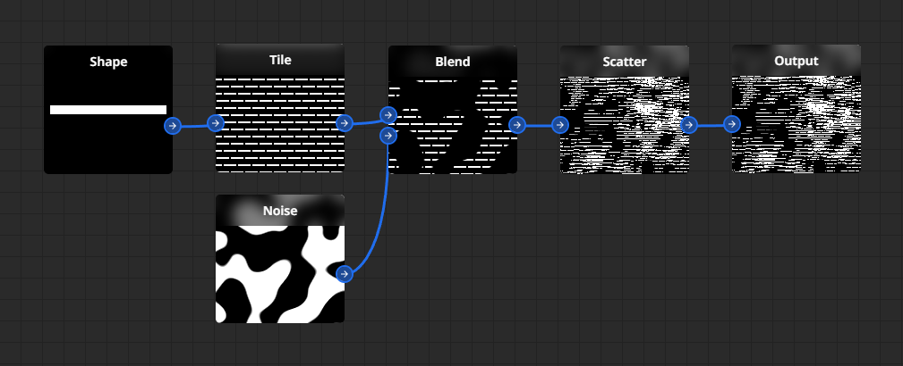

    

# Welcome to Materializer

[Materializer.app](https://materializer.app) is a free, interactive, node-based procedural material design tool that runs in your web browser!

It's currently in heavy development, so it lacks many features and might contain bugs, but you can already head over to [materializer.app](https://materializer.app) and play with what it's already got.
If you find any critical bugs feel free to post about it in the [Issues](https://github.com/adamwych/materializer/issues) page.

The workflow is inspired by Substance Designer, so if you're familiar with with it you should be able to pick up Materializer easily.

## Getting started

In Materializer you create textures by creating a graph of nodes. Each node specifies _inputs_ and _outputs_. By combining nodes you get interesting shapes and patterns.

At the very end of your graph you should always place an `Output` node, it will allow you to see what your final texture looks like on a 3D model in the preview window.

To add a node press `Space` when hovering over the graph.

## Supported platforms

Materializer's renderer is fully GPU-accelerated, it uses WebGL 2 technology, so if your browser is not up to date, it might not work right!

Chromium-based browsers perform the best, it's highly recommended to use one (e.g. Google Chrome, Brave) if you can. Firefox struggles with high-resolution textures due to excessive copying that it does under the hood but works well for low-resolution.

Support for mobile devices is not planned.

| OS      | Browser                   |
| ------- | ------------------------- |
| Windows | Chrome 118+, Firefox 119+ |
| Linux   | -                         |
| macOS   | -                         |

## Contributing

Currently there's no specific roadmap and contributing workflow, if you'd like to contribute, feel free to make a pull request.

## License

Materializer is licensed under the [GNU GPL v3](https://github.com/adamwych/materializer/LICENSE) license.
